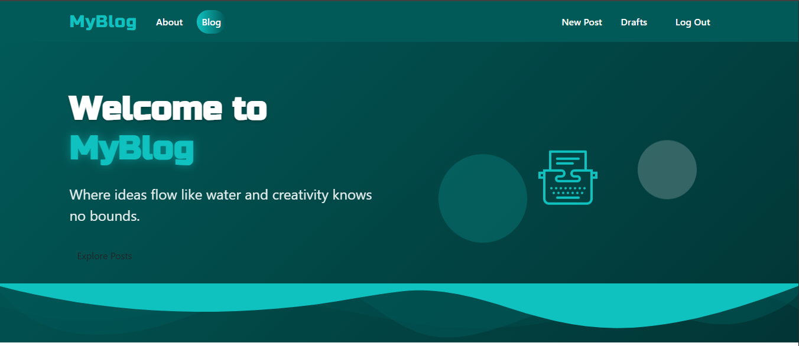
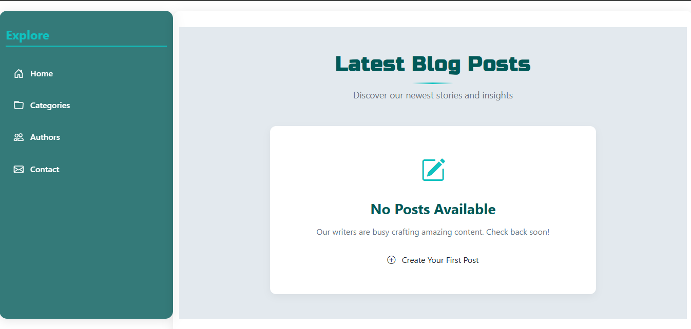
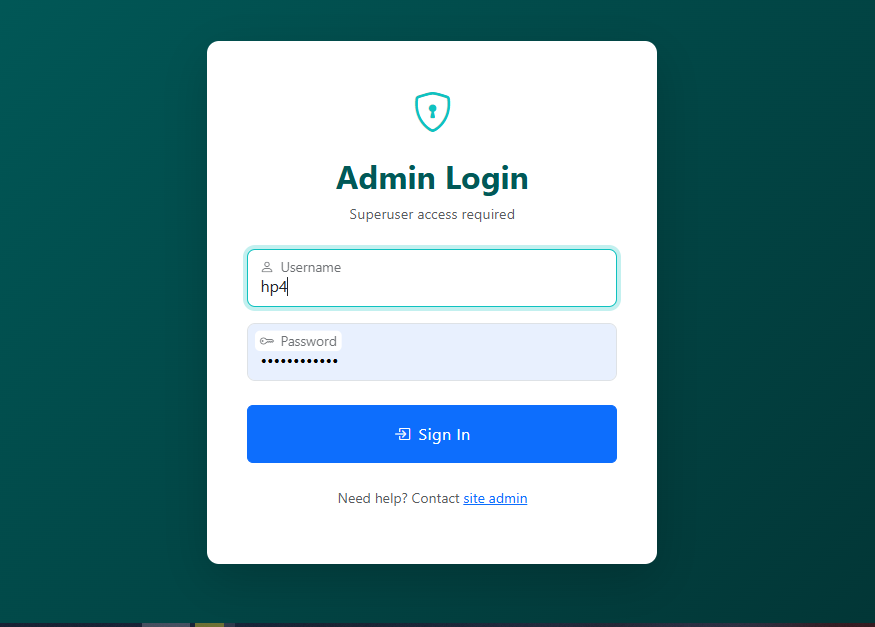
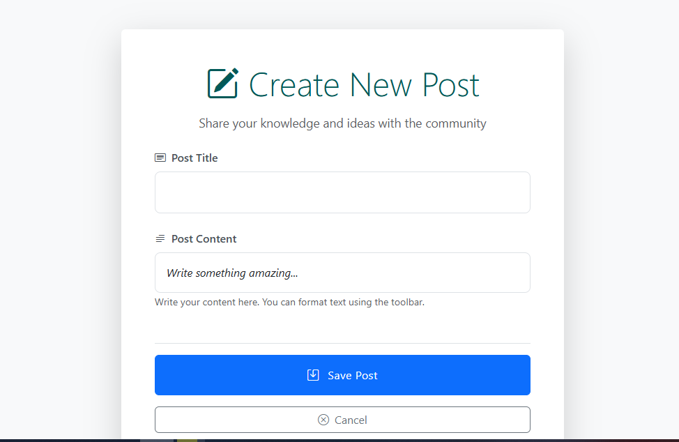
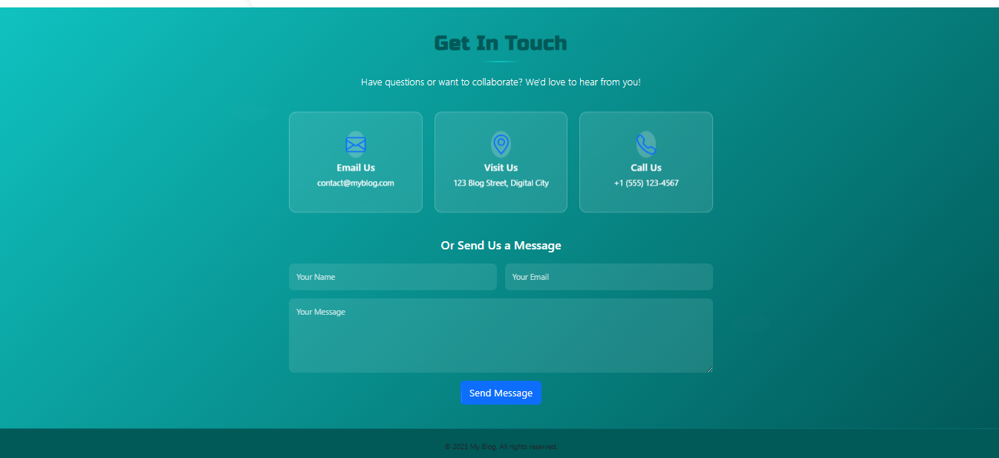
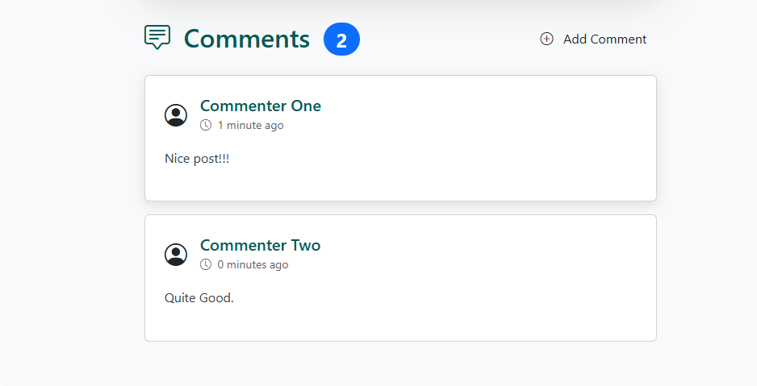

# MYBLOG ✍️



A full-featured blogging platform built with Django that allows users to create, share, and discuss content.

## 🌟 Features

### 🔐 Authentication
- Admin login/logout
- Password reset functionality
- Profile management

### 📝 Blog Post System
- Create, edit, and delete posts
- Rich text formatting (Markdown support)
- Post categories and tags
- Featured posts highlighting

### 💬 Commenting System
- Comment on any post
- Comment moderation (for admin)

### 🎨 Additional Features
- Responsive design (works on mobile/tablet)
- User dashboard with activity feed

## 📸 Screenshots

|  |  |
|-----------------------------------|--------------------------------------|
| *Blog Homepage*                   | *No Post*                           |

|  |      |
|---------------------------------|-----------------------------------------|
| *User Login*                    | *Post list*                        |

|  |
|---------------------------------------------|
| *Create Post*                               | 

|  |  |
|-----------------------------------|---------------------------------------|
| *Footer*                          | *Comments*                            |

## 🛠️ Tech Stack

**Backend:**
- Python 3.10+
- Django 4.2
- SQLite (production database)

**Frontend:**
- Bootstrap 5
- TinyMCE (rich text editor)

**Authentication:**
- Django Allauth
- JWT tokens (for API)

## 🚀 Installation

1. Clone the repository:
   ```bash
   git clone https://github.com/DrLeroK/my_blog.git
   cd my_blog